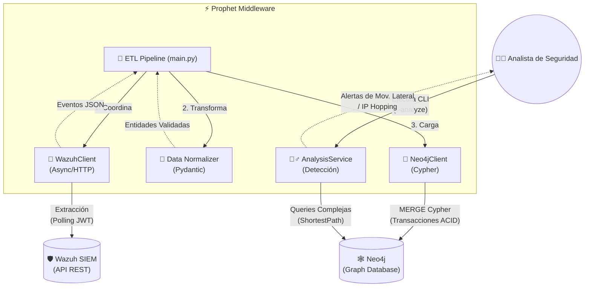
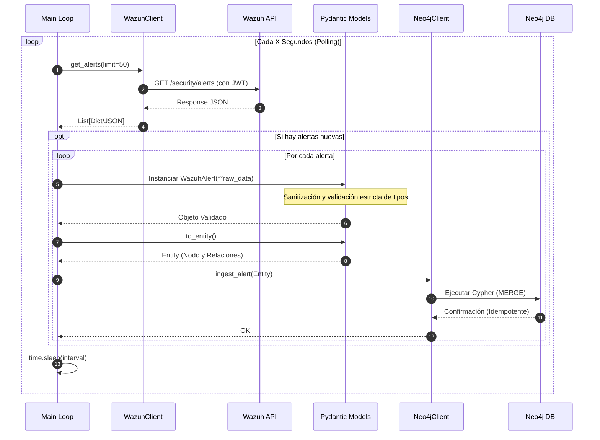
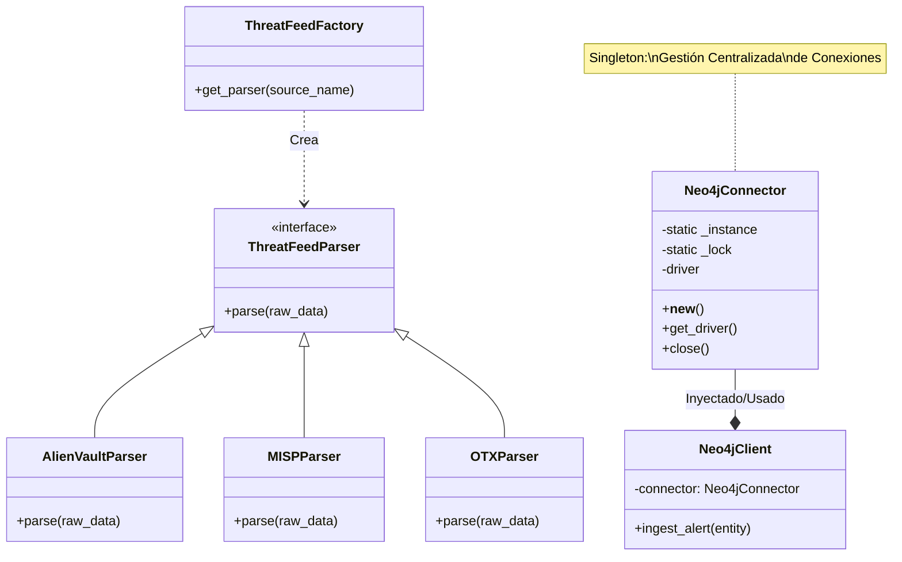

# Prophet �️‍🗨️

> **Middleware de Ciberseguridad ETL: De Wazuh a Neo4j**


## 📖 ¿Qué es Prophet?

**Prophet** es una herramienta de ingeniería de seguridad diseñada para actuar como un puente inteligente (Middleware ETL) entre un SIEM (**Wazuh**) y una base de datos orientada a grafos (**Neo4j**).

Su función principal es transformar alertas de seguridad planas y aisladas en un **grafo de conocimiento dinámico**, permitiendo a los analistas de seguridad visualizar y consultar relaciones complejas entre atacantes, activos, usuarios y eventos en tiempo real, conectándolas de forma nativa con **Inteligencia de Amenazas (MITRE ATT&CK / STIX)**.

## 🎯 Objetivo

El problema de los SIEM tradicionales es que almacenan los datos de forma tabular o documental (índices). Esto hace difícil responder preguntas como:

- _"¿Qué otros servidores ha tocado la misma IP que atacó al servidor X?"_
- _"¿El usuario comprometido en el evento A ha iniciado sesión en otros sistemas críticos recientemente?"_

**El objetivo de Prophet es revelar estas conexiones ocultas**, permitiendo:

1.  **Correlación Avanzada**: Detectar movimientos laterales y patrones de ataque distribuidos.
2.  **Enriquecimiento Dinámico**: Resolución automática en caché de dominios DNS y geolocalización de atacantes.
3.  **Análisis Forense Visual**: Seguir la traza de un atacante saltando entre nodos.
4.  **Detección de Anomalías Relacionales**: Identificar comportamientos atípicos basados en la topología de la red.
5.  **Cálculo del Blast Radius**: Evaluar inmediatamente el "radio de explosión" o impacto derivado de la detección de una técnica de ATT&CK específica.

## 🏗️ Arquitectura e Implementación

Prophet está construido siguiendo principios de **Clean Architecture** y **DevSecOps**:

1.  **Extracción (Extract)**:
    - Un cliente asíncrono consulta la API de Wazuh periódicamente.
    - Maneja autenticación JWT segura y rotación de tokens.
2.  **Transformación (Transform)**:
    - **Normalización**: Convierte JSONs crudos de Wazuh en modelos estrictos (`Pydantic`).
    - **Sanitización**: Limpia inputs para prevenir inyecciones y asegura tipos de datos correctos.
3.  **Carga (Load)**:
    - Proyecta las entidades en **Neo4j** utilizando transacciones ACID.
    - Uso de **Singleton Pattern** para `Neo4jConnector`, asegurando una gestión eficiente de conexiones.
    - Implementación del **Repository Pattern** (`Neo4jAlertRepository`) para ingestas masivas.
    - Ingestión escalable en lote (_Batch Insert_) empleando comandos `UNWIND` de Cypher, que procesa cientos de alertas simultáneamente sin bloquear la DB.
    - Mapeo dinámico hacia el modelo **STIX/TAXII** (Tácticas, Técnicas, Mitigaciones).
    - Resolución y enriquecimiento de red **(DNS y GeoIP)** al vuelo.

### 🧩 Patrones de Diseño y Mejoras

Se han integrado patrones de diseño robustos para garantizar escalabilidad, rendimiento y mantenibilidad:

1.  **Singleton (Base de Datos)**:
    - Implementado en `Neo4jConnector` (Thread-Safe).
    - **Beneficio**: Asegura una única instancia de conexión global, optimizando el uso de recursos y previniendo la saturación del pool de conexiones hacia Neo4j.

2.  **Factory Method (Threat Intelligence)**:
    - Implementado en `ThreatFeedFactory`.
    - **Beneficio**: Permite la incorporación transparente de nuevas fuentes de amenazas (feeds) sin modificar el código cliente.

3.  **Dependency Injection (Servicios)**:
    - Implementado en `GraphService`.
    - **Beneficio**: Facilita el testing unitario al permitir inyectar mocks de la base de datos.

### 📐 Arquitectura, Diseño y Patrones (UML)

Para comprender en profundidad cómo Prophet interactúa con su entorno, el flujo de datos interno y los patrones de diseño aplicados, a continuación se presentan los diagramas UML que modelan el sistema.

#### 1. Diagrama de Componentes (Arquitectura General)

Este diagrama ilustra la arquitectura de alto nivel de **Prophet**, mostrando cómo se sitúa como Middleware ETL entre Wazuh (origen de datos) y Neo4j (destino y motor de análisis).



#### 2. Diagrama de Secuencia (Flujo de Ejecución Continuo)

Muestra el paso a paso del proceso ETL principal y cómo interactúan las distintas capas informáticas en tiempo de ejecución.



#### 3. Diagrama de Clases (Patrones de Diseño)

Modelado de los principales patrones de diseño orientados a objetos utilizados en el núcleo de la aplicación (Singleton, Factory y Dependency Injection) para garantizar robustez y un código limpio.



## 🚀 Mejoras Implementadas (Sprint de Refactoring)

Recientemente se ha sometido el proyecto a una auditoría y refactorización profunda para asegurar su calidad en producción:

- ✅ **Thread-Safe Singleton**: Se corrigió la implementación del conector de base de datos para ser seguro en entornos concurrentes usando `threading.Lock`.
- ✅ **Suite de Tests Completa**: Se añadió un framework de pruebas (`pytest`) cubriendo:
  - Lógica de conexión a base de datos (con mocks).
  - Validación y sanitización de modelos de datos.
  - Lógica de los parsers de inteligencia de amenazas.
- ✅ **Inyección de Dependencias**: Refactorización de servicios clave para desacoplarlos de la infraestructura concreta, facilitando el mantenimiento y las pruebas.

### Modelo de Grafo (MITRE ATT&CK & STIX Entrelazado)

Prophet modela la realidad usando el siguiente esquema enriquecido con ciberinteligencia:

- `(:IP address)` ➡️ `[:INITIATED]` ➡️ `(:Event)`
- `(:User username)` ➡️ `[:TRIGGERED]` ➡️ `(:Event)`
- `(:Event)` ➡️ `[:TARGETED]` ➡️ `(:IP address)`
- `(:Event)` ➡️ `[:OCCURRED_ON]` ➡️ `(:Host hostname)`
- `(:Event)` ➡️ `[:INDICATES]` ➡️ `(:Technique technique_id)`
- `(:Event)` ➡️ `[:INDICATES]` ➡️ `(:Tactic name)`
- `(:IP address)` ➡️ `[:RESOLVES_TO]` ➡️ `(:Domain name)`
- `(:IP address)` ➡️ `[:LOCATED_IN]` ➡️ `(:Location country_name)`
- `(:Mitigation mitigation_id)` ➡️ `[:MITIGATES]` ➡️ `(:Technique technique_id)`

### 🕵️‍♂️ Análisis y Detección de Amenazas

Prophet no solo almacena datos, sino que aplica algoritmos de grafos para detectar patrones complejos:

#### 1. Movimiento Lateral

Detecta cuando un usuario comprometido salta entre hosts en un periodo corto de tiempo.

- **Patrón**: `User -> Host A -> Evento -> Host B`
- **Ventana de Tiempo**: 60 minutos (configurable).
- **Algoritmo**: Búsqueda de caminos con restricciones temporales (`e1.timestamp < e2.timestamp`).

#### 2. Cadenas Sospechosas (IP Hopping)

Identifica IPs que inician ataques utilizando múltiples saltos intermedios.

- **Patrón**: `IP A -> Evento -> IP B`

#### 3. Cálculo de Impacto (Blast Radius)

Mapea la diseminación de una táctica atacante.

- **Patrón**: `Technique <- Evento -> Host/User`
- **Uso Crítico**: Al saltar una alerta crítica de Wazuh, esta proyección extrae todos los recursos de red y usuarios bajo fuego por esa misma Táctica mitigando rápidamente su expansión.

> 📚 **Cyber Playbooks (Cypher)**: Para ver ejemplos avanzados de cómo consultar la Inteligencia de Amenazas y el _Blast Radius_ utilizando Neo4j, consulta nuestro manual de playbooks: [docs/cypher_examples.md](docs/cypher_examples.md).

## Instalación y Uso

### Ejecución de Análisis (CLI)

Puedes ejecutar un análisis bajo demanda para buscar movimientos laterales en los datos ya ingestado:

```bash
# Ejecutar análisis de grafos
python src/main.py --analyze
```

La forma recomendada de desplegar Prophet es mediante **Docker**, asegurando un entorno aislado y reproducible.

### Prerrequisitos

- Docker y Docker Compose instalados.
- Credenciales de API de tu instancia de Wazuh.

### Paso 1: Clonar e Iniciar

```bash
# Clonar el repositorio
git clone https://github.com/tu-usuario/prophet.git
cd prophet

# Configurar variables de entorno
cp .env.example .env
# EDITA el archivo .env con tus credenciales reales (Wazuh URL, Users, Passwords)
```

### Paso 2: Despliegue

```bash
docker-compose up -d --build
```

Esto levantará dos contenedores:

1.  **neo4j**: Base de datos de grafos (Accesible en `http://localhost:7474`).
2.  **prophet**: El servicio ETL que empezará a ingerir datos.

### Paso 3: Visualización

Accede al navegador de Neo4j (`http://localhost:7474`) y ejecuta consultas Cypher para ver tus datos:

```cypher
// Ver quién está atacando a más de 3 hosts distintos
MATCH (attacker:IP)-[:INITIATED]->(:Event)-[:TARGETED]->(victim:IP)
WITH attacker, count(DISTINCT victim) as victim_count
WHERE victim_count > 3
RETURN attacker.address, victim_count
ORDER BY victim_count DESC
```

## ⚙️ Configuración (.env)

| Variable           | Descripción                            | Valor por Defecto   |
| ------------------ | -------------------------------------- | ------------------- |
| `WAZUH_URL`        | URL de la API de Wazuh                 | _Requerido_         |
| `WAZUH_USER`       | Usuario de API (Read-only recomendado) | _Requerido_         |
| `WAZUH_VERIFY_SSL` | Validar certificados HTTPS             | `True`              |
| `NEO4J_URI`        | URI de conexión a Neo4j                | `bolt://neo4j:7687` |
| `LOG_LEVEL`        | Nivel de detalle de logs               | `INFO`              |

## 🛡️ Seguridad (SSDLC)

Este proyecto ha sido desarrollado siguiendo estrictas "Reglas de Oro" de seguridad:

- **No-Root**: El contenedor Docker corre bajo un usuario sin privilegios.
- **Injection Safe**: Todas las consultas a la base de datos están parametrizadas.
- **Secret Management**: Uso estricto de variables de entorno; nada hardcodeado.
- **Input Validation**: Todo dato externo es validado con `Pydantic` antes de ser procesado.

---

Hecho con � y ❤️ para Blue Teamers.
