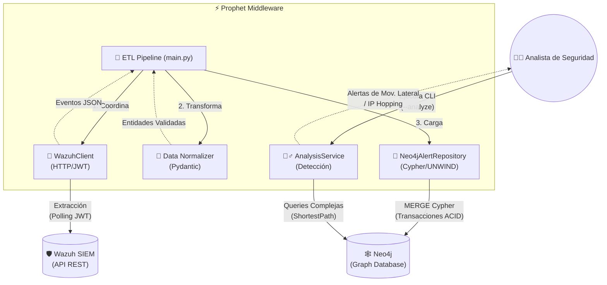
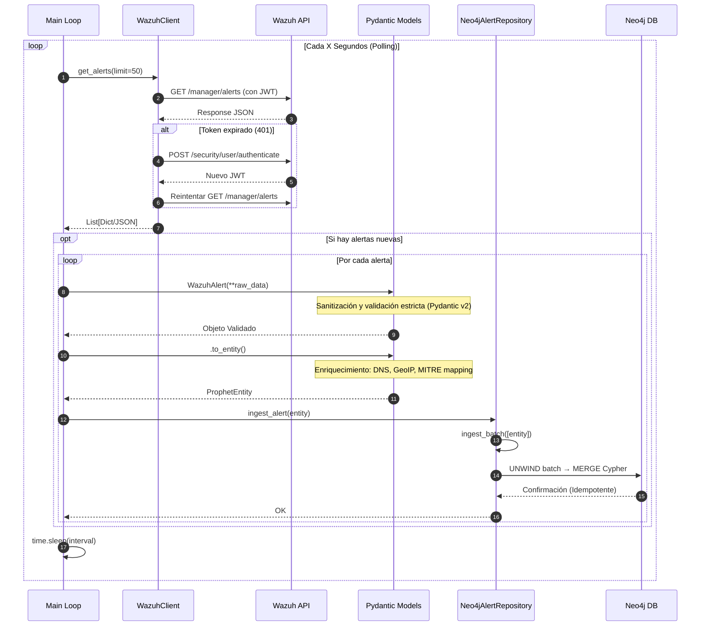
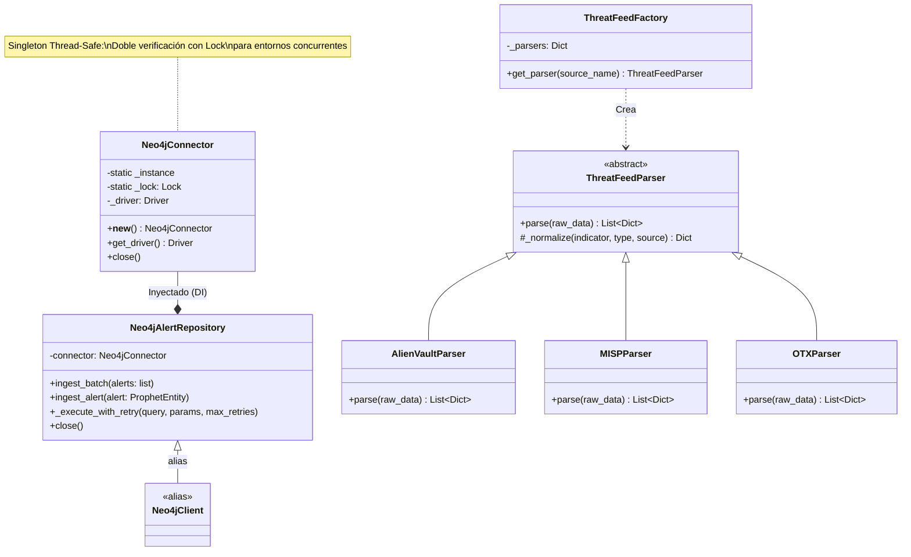
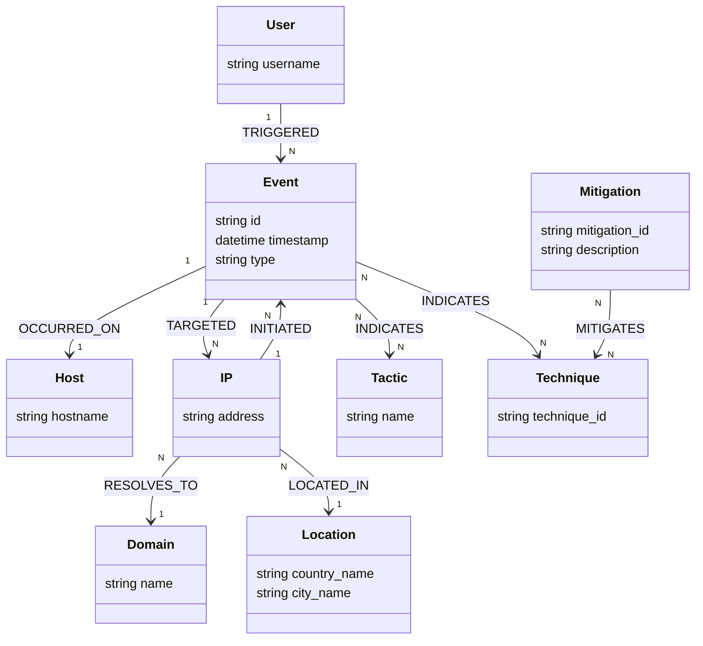

# Prophet 🕵️‍🗨️

> **Middleware de Ciberseguridad ETL: De Wazuh a Neo4j**


---

## 📖 ¿Qué es Prophet?

**Prophet** es una herramienta de ingeniería de seguridad diseñada para actuar como un puente inteligente (Middleware ETL) entre un SIEM (**Wazuh**) y una base de datos orientada a grafos (**Neo4j**).

Su función principal es transformar alertas de seguridad planas y aisladas en un **grafo de conocimiento dinámico**, permitiendo a los analistas de seguridad visualizar y consultar relaciones complejas entre atacantes, activos, usuarios y eventos en tiempo real, conectándolas de forma nativa con **Inteligencia de Amenazas (MITRE ATT&CK / STIX)**.

---

## 🎯 Objetivo

El problema de los SIEM tradicionales es que almacenan los datos de forma tabular o documental (índices). Esto hace difícil responder preguntas como:

- _"¿Qué otros servidores ha tocado la misma IP que atacó al servidor X?"_
- _"¿El usuario comprometido en el evento A ha iniciado sesión en otros sistemas críticos recientemente?"_

**El objetivo de Prophet es revelar estas conexiones ocultas**, permitiendo:

1. **Correlación Avanzada**: Detectar movimientos laterales y patrones de ataque distribuidos.
2. **Enriquecimiento Dinámico**: Resolución automática en caché de dominios DNS y geolocalización de atacantes.
3. **Análisis Forense Visual**: Seguir la traza de un atacante saltando entre nodos.
4. **Detección de Anomalías Relacionales**: Identificar comportamientos atípicos basados en la topología de la red.
5. **Cálculo del Blast Radius**: Evaluar el impacto derivado de la detección de una técnica ATT&CK específica.

---

## 🏗️ Arquitectura e Implementación

Prophet está construido siguiendo principios de **Clean Architecture**, **SOLID** y **DevSecOps**:

1. **Extracción (Extract)**:
   - `WazuhClient` consulta la API de Wazuh periódicamente mediante _polling_.
   - Maneja autenticación JWT segura, rotación automática de tokens (re-auth en 401) y reintentos con backoff.

2. **Transformación (Transform)**:
   - **Normalización**: Convierte JSONs crudos de Wazuh en modelos estrictos (`Pydantic v2`).
   - **Sanitización**: Limpia inputs (usuarios, hostnames) mediante regex para prevenir inyecciones.
   - **Enriquecimiento**: Resolucion DNS (cacheada con `lru_cache`) y mapping MITRE ATT&CK estático.

3. **Carga (Load)**:
   - Proyecta las entidades en **Neo4j** utilizando transacciones ACID.
   - **Singleton Pattern** para `Neo4jConnector` (thread-safe) → una sola conexión global.
   - **Repository Pattern** (`Neo4jAlertRepository`) → ingestión masiva con `UNWIND` Cypher.
   - `ingest_alert(entity)` → wrapper de un solo elemento que delega en `ingest_batch([entity])`.

---

### 🧩 Patrones de Diseño y Principios SOLID

| Patrón | Clase | Beneficio |
|--------|-------|-----------|
| **Singleton** | `Neo4jConnector` | Una única instancia thread-safe del driver Neo4j evita la saturación del pool de conexiones. |
| **Repository** | `Neo4jAlertRepository` | Desacopla la lógica de negocio de la infraestructura de BD; facilita mocking en tests. |
| **Factory Method** | `ThreatFeedFactory` | Conecta nuevas fuentes de inteligencia de amenazas sin modificar el código base existente. |
| **Dependency Injection** | Todos los servicios | Los constructores aceptan dependencias externas; fundamental para TDD sin infra real. |

> **SOLID aplicado**: La separación `WazuhClient` / `Neo4jAlertRepository` / `AnalysisService` respeta **SRP** (una sola responsabilidad por clase). La inyección de `Neo4jConnector` respeta **DIP** (depender de abstracciones, no de implementaciones concretas). El `ThreatFeedFactory` respeta **OCP** (abierto para extensión, cerrado para modificación).

---

### 📐 Arquitectura y Diagramas UML

#### 1. Diagrama de Componentes (Arquitectura General)



#### 2. Diagrama de Secuencia (Flujo de Ejecución Continuo)



> **Nota sobre `ingest_alert`**: Es un método de conveniencia que envuelve la llamada a `ingest_batch([entity])`. Esto mantiene la interfaz pública simple para el bucle principal (`main.py`) sin sacrificar la eficiencia del batch en inserciones masivas.

#### 3. Diagrama de Clases (Patrones de Diseño)



---

### Modelo de Grafo (MITRE ATT&CK & STIX Entrelazado)

Prophet modela la realidad usando el siguiente esquema enriquecido con ciberinteligencia:

- `(:IP address)` ➡️ `[:INITIATED]` ➡️ `(:Event)`
- `(:User username)` ➡️ `[:TRIGGERED]` ➡️ `(:Event)`
- `(:Event)` ➡️ `[:TARGETED]` ➡️ `(:IP address)`
- `(:Event)` ➡️ `[:OCCURRED_ON]` ➡️ `(:Host hostname)`
- `(:Event)` ➡️ `[:INDICATES]` ➡️ `(:Technique technique_id)`
- `(:Event)` ➡️ `[:INDICATES]` ➡️ `(:Tactic name)`
- `(:IP address)` ➡️ `[:RESOLVES_TO]` ➡️ `(:Domain name)`
- `(:IP address)` ➡️ `[:LOCATED_IN]` ➡️ `(:Location country_name)`
- `(:Mitigation mitigation_id)` ➡️ `[:MITIGATES]` ➡️ `(:Technique technique_id)`

> **Por qué este diseño ontológico**: Desacoplar atributos en nodos independientes (ej. `country` → `(:Location)` en lugar de una propiedad plana en `(:Event)`) habilita trazado de conexiones ocultas y consultas forenses de alta dimensionalidad: _¿qué eventos aislados comparten el mismo País Atacante y Táctica MITRE?_



---

### 🕵️‍♂️ Análisis y Detección de Amenazas

Prophet no solo almacena datos, sino que aplica algoritmos de grafos para detectar patrones complejos:

#### 1. Movimiento Lateral
Detecta cuando un usuario comprometido salta entre hosts en un periodo corto de tiempo.
- **Patrón**: `User -> Host A -> Evento -> Host B`
- **Ventana de Tiempo**: 60 minutos (configurable mediante `time_window_minutes`).
- **Algoritmo**: Búsqueda de caminos con restricciones temporales (`e1.timestamp < e2.timestamp`).

#### 2. Cadenas Sospechosas (IP Hopping)
Identifica IPs que inician ataques usando múltiples saltos intermedios.
- **Patrón**: `IP A -> Evento -> IP B`

#### 3. Cálculo de Impacto (Blast Radius)
Mapea la diseminación de una táctica atacante.
- **Patrón**: `Technique <- Evento -> Host/User`
- **Uso Crítico**: Al detectar una alerta crítica, extrae todos los recursos y usuarios bajo fuego por esa misma Táctica.

> 📚 **Cyber Playbooks (Cypher)**: Para ver ejemplos avanzados de consultas de Inteligencia de Amenazas y _Blast Radius_, consulta [docs/cypher_examples.md](docs/cypher_examples.md).

---

## 🧪 Testing y Calidad del Código

### Suite de Pruebas

Prophet incluye una suite de tests unitarios completa construida con **pytest** y **pytest-mock**, diseñada para ejecutarse sin necesidad de infraestructura real (Neo4j, Wazuh). Todos los componentes de infraestructura son sustituidos por mocks mediante inyección de dependencias.

```
tests/
├── conftest.py                  # Variables de entorno mock globales
├── test_models.py               # Validación y sanitización de modelos Pydantic
├── test_analysis_service.py     # Lógica de detección de amenazas (con DB mock)
├── test_database.py             # Patrón Singleton del Neo4jConnector
├── test_graph_service.py        # Neo4jAlertRepository: batch, retry, alias
├── test_wazuh_client.py         # WazuhClient: autenticación, re-auth 401, manejo de errores
├── test_dns_resolver.py         # DNSResolver: resolución, errores, caché LRU
├── test_parsers.py              # Parsers de Threat Intelligence (AlienVault, MISP, OTX)
└── test_threat_intelligence.py  # ThreatFeedFactory
```

### Ejecución

```bash
# Activar entorno virtual
.venv\Scripts\activate          # Windows
source .venv/bin/activate       # Linux/macOS

# Ejecutar todos los tests
pytest tests/ -v

# Ejecutar con reporte de cobertura
pytest tests/ --cov=src --cov-report=term-missing
```

### Cobertura Actual

| Módulo | Cobertura |
|--------|-----------|
| `config/settings.py` | 100% |
| `core/dns_resolver.py` | 100% |
| `models/analysis_results.py` | 100% |
| `services/threat_intelligence/factory.py` | 100% |
| `services/threat_intelligence/parsers.py` | 97% |
| `services/analysis_service.py` | 95% |
| `services/graph_service.py` | 93% |
| `models/wazuh.py` | 91% |
| `core/database.py` | 89% |
| `services/wazuh_client.py` | 84% |
| **Total (lógica de negocio)** | **~92%** |

> `main.py` (entrypoint con `while True`) se excluye intencionalmente: su lógica de negocio está cubierta a través de los tests de sus dependencias.

---

## 🔧 Registro de Cambios Técnicos (Testing Sprint)

Esta sección documenta las correcciones aplicadas durante el sprint de testing, detallando el razonamiento técnico detrás de cada una para facilitar futuras modificaciones.

### Bug #1 — `Neo4jClient`: nombre de clase inexistente (Crítico)

**Archivo**: `src/main.py` · `src/services/graph_service.py`

**Problema**: `main.py` importaba `Neo4jClient` pero la clase exportada en `graph_service.py` se llamaba `Neo4jAlertRepository`. Esto causaba un `ImportError` en runtime en el arranque del proceso.

**Solución**: Se añadió un alias de compatibilidad al final de `graph_service.py`:
```python
# graph_service.py
Neo4jClient = Neo4jAlertRepository
```
**Razonamiento**: Usar un alias preserva la interfaz pública existente (`main.py` y los diagramas UML) sin renombrar la clase interna, manteniendo el nombre descriptivo del patrón Repository y evitando romper código futuro que referencie `Neo4jAlertRepository` directamente.

---

### Bug #2 — `ingest_alert()`: método inexistente (Crítico)

**Archivo**: `src/services/graph_service.py`

**Problema**: `main.py` llamaba a `neo4j_client.ingest_alert(entity)` en el bucle principal, pero `Neo4jAlertRepository` solo exponía `ingest_batch(list)`. Esto causaba un `AttributeError` en la primera alerta procesada.

**Solución**: Se añadió el método `ingest_alert` como wrapper de conveniencia:
```python
def ingest_alert(self, alert: ProphetEntity):
    """Convenience method — delegates to ingest_batch for single-entity ingestion."""
    self.ingest_batch([alert])
```
**Razonamiento**: El diseño interno usa `ingest_batch` para eficiencia (Cypher `UNWIND`). En lugar de cambiar `main.py` para construir listas manualmente, se expone `ingest_alert` como una abstracción de alto nivel que envuelve esa eficiencia. Sigue el principio de **Tell, Don't Ask**: el llamador no necesita saber cómo se implementa la ingesta internamente.

---

### Bug #3 — Cypher DNS Domain: nodos `IP` huérfanos con `target_ip = NULL` (Medio)

**Archivo**: `src/services/graph_service.py` — Query Cypher, paso 7

**Problema**: La cláusula FOREACH del paso 7 (fusión de dominios DNS) solo verificaba que `dns_domain` no fuera `NULL`, pero ejecutaba `MERGE (dst:IP {address: alert.target_ip})` incondicionalmente. Si `target_ip` era `NULL`, se creaba un nodo `(:IP {address: null})` huérfano en el grafo, corrompiendo el modelo de datos.

**Solución**: Se amplió la condición del FOREACH:
```cypher
// ANTES — Vulnerable a nodo IP huérfano
FOREACH (ignoreMe IN CASE WHEN alert.dns_domain IS NOT NULL THEN [1] ELSE [] END |
    MERGE (d:Domain {name: alert.dns_domain})
    MERGE (dst:IP {address: alert.target_ip})   -- ← se ejecuta aunque target_ip sea NULL
    MERGE (dst)-[:RESOLVES_TO]->(d)
)

// DESPUÉS — Correctamente guardado
FOREACH (ignoreMe IN CASE WHEN alert.dns_domain IS NOT NULL AND alert.target_ip IS NOT NULL THEN [1] ELSE [] END |
    MERGE (d:Domain {name: alert.dns_domain})
    MERGE (dst:IP {address: alert.target_ip})
    MERGE (dst)-[:RESOLVES_TO]->(d)
)
```
**Razonamiento**: En Neo4j, un `MERGE` con una propiedad `NULL` crea un nodo con esa propiedad como `null`, lo que viola la integridad del modelo de grafo (todos los nodos `(:IP)` deberían tener una dirección válida). Este tipo de corrupción silenciosa es difícil de detectar post-hoc.

---

### Bug #4 — `basicConfig` a nivel de módulo (Bajo)

**Archivo**: `src/services/graph_service.py`

**Problema**: El módulo ejecutaba `logging.basicConfig()` condicionalmente en el cuerpo del módulo (nivel de importación). Esto conflictuaba con `setup_logging()` en `core/logging.py`, que configura handlers, formatos y niveles de forma centralizada. Según la documentación de Python, `basicConfig` es un no-op si ya existen handlers en el root logger, pero la inicialización de orden indeterminado al importar puede causar logs inconsistentes.

**Solución**: Se eliminó el bloque condicional y se usa directamente `logging.getLogger(__name__)`, que es el patrón estándar en Python:
```python
# ANTES
logger = logging.getLogger(__name__)
if not logger.handlers:
    logging.basicConfig(level=settings.log_level)

# DESPUÉS
logger = logging.getLogger(__name__)
```

---

### Bug #5 — `import base64` sin usar (Bajo)

**Archivo**: `src/services/wazuh_client.py`

**Problema**: Se importaba `base64` pero no se usaba en ninguna parte del módulo. La autenticación HTTP Basic está delegada al parámetro `auth=(user, pass)` de `requests`, que maneja la codificación Base64 internamente.

**Solución**: Se eliminó el import. Además de evitar advertencias de linters (`F401 - imported but unused`), mantener los imports limpios mejora la legibilidad y reduce la superficie de confusión para futuros desarrolladores.

---

### Bug #6 — Test roto: campo `id` faltante en `ProphetEntity` (Test)

**Archivo**: `tests/test_models.py`

**Problema**: `test_prophet_entity_sanitization` construía `ProphetEntity(...)` sin el campo `id`, que es un campo requerido (`Field(...)`) en el modelo Pydantic. Esto causaba un `ValidationError` inmediato, haciendo que el test fallara antes de llegar a cualquier aserción.

**Solución**: Se añadió `id="test-sanitize-01"` al constructor del test.

---

## 🚀 Mejoras Implementadas (Sprints Previos)

- ✅ **Thread-Safe Singleton**: Conector de base de datos seguro en concurrencia con doble verificación y `threading.Lock`.
- ✅ **Retry con Backoff Exponencial**: `_execute_with_retry` reintenta transacciones Neo4j fallidas hasta 3 veces con espera incremental (`2^attempt` segundos).
- ✅ **Re-autenticación JWT Automática**: `WazuhClient` detecta respuestas 401 y renueva el token sin interrumpir el polling.
- ✅ **Caché LRU de DNS**: `DNSResolver.resolve_ip` usa `@lru_cache(maxsize=1000)` para evitar consultas DNS repetidas en el pipeline ETL.
- ✅ **Sanitización de Inputs**: `ProphetEntity` aplica validadores `@field_validator` en `hostname` y `user` para eliminar caracteres no permitidos antes de cualquier escritura en BD.

---

## Instalación y Uso

### Ejecución de Análisis (CLI)

```bash
# Modo continuo (ETL polling)
python src/main.py

# Modo análisis bajo demanda (detecta movimiento lateral e IP hopping)
python src/main.py --analyze
```

### Prerrequisitos

- Docker y Docker Compose instalados.
- Credenciales de API de tu instancia de Wazuh.

### Paso 1: Configuración del entorno

```bash
git clone https://github.com/George230297/prophet.git
cd prophet

# Copiar plantilla y rellenar con credenciales reales
cp .env.example .env
```

### Paso 2: Despliegue con Docker

```bash
docker-compose up -d --build
```

Levantará dos contenedores:
1. **neo4j**: Base de datos de grafos (UI en `http://localhost:7474`).
2. **prophet**: El servicio ETL que empezará a ingerir datos de Wazuh.

### Paso 3: Visualización en Neo4j Browser

```cypher
// Ver IPs que atacan a más de 3 hosts distintos
MATCH (attacker:IP)-[:INITIATED]->(:Event)-[:TARGETED]->(victim:IP)
WITH attacker, count(DISTINCT victim) as victim_count
WHERE victim_count > 3
RETURN attacker.address, victim_count
ORDER BY victim_count DESC
```

---

## ⚙️ Configuración (.env)

| Variable | Descripción | Valor por Defecto |
|----------|-------------|-------------------|
| `WAZUH_URL` | URL de la API de Wazuh | _Requerido_ |
| `WAZUH_USER` | Usuario de API (Read-only recomendado) | _Requerido_ |
| `WAZUH_PASSWORD` | Contraseña de API de Wazuh | _Requerido_ |
| `WAZUH_VERIFY_SSL` | Validar certificados HTTPS | `True` |
| `NEO4J_URI` | URI de conexión a Neo4j | `bolt://neo4j:7687` |
| `NEO4J_USER` | Usuario de Neo4j | `neo4j` |
| `NEO4J_PASSWORD` | Contraseña de Neo4j | _Requerido_ |
| `LOG_LEVEL` | Nivel de detalle de logs | `INFO` |
| `POLLING_INTERVAL` | Segundos entre ciclos de polling | `10` |
| `APP_ENV` | Entorno de ejecución | `development` |

---

## 🛡️ Seguridad (SSDLC)

Este proyecto ha sido desarrollado siguiendo estrictas prácticas de seguridad en el ciclo de desarrollo:

- **No-Root**: El contenedor Docker corre bajo un usuario sin privilegios.
- **Injection Safe**: Todas las consultas Neo4j usan parámetros Cypher (`$variable`), nunca interpolación de strings.
- **Secret Management**: Uso estricto de variables de entorno; cero credenciales hardcodeadas.
- **Input Validation**: Todo dato externo es validado por `Pydantic v2` antes de ser procesado (`WazuhAlert`) y sanitizado antes de ser almacenado (`ProphetEntity`).
- **SSL Configurable**: `WAZUH_VERIFY_SSL=True` por defecto; desactivarlo emite un warning explícito en los logs.
- **Tests sin Infraestructura Real**: La suite de tests usa mocks para Neo4j y Wazuh, evitando filtración de credenciales en entornos de CI/CD.

---

Hecho con 🔍 y ❤️ para Blue Teamers.
